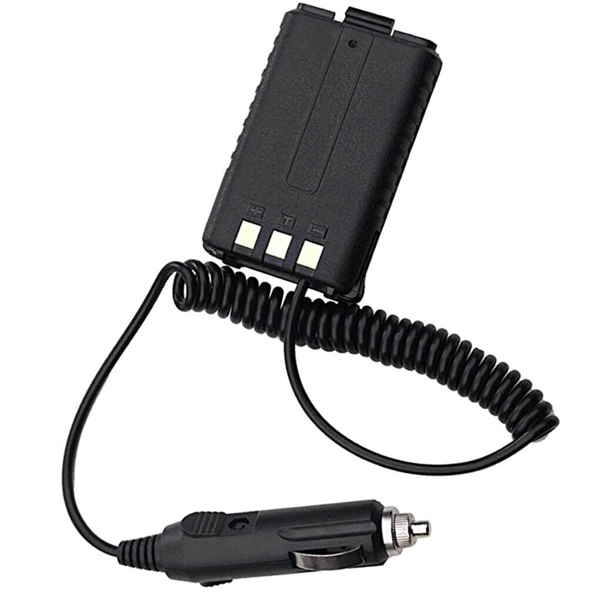
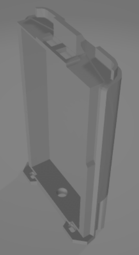
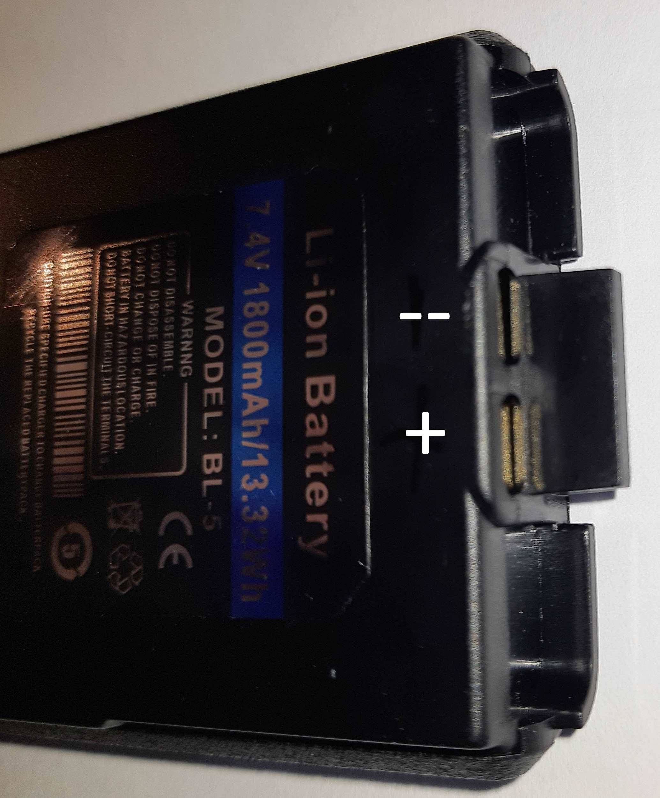
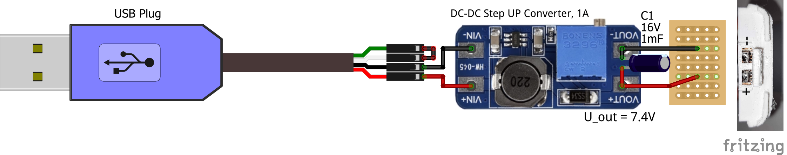
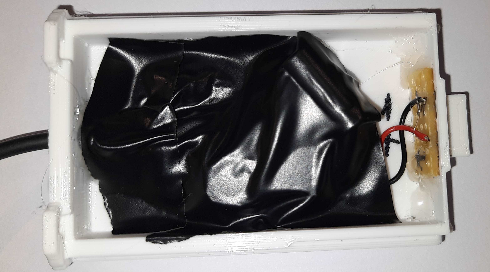
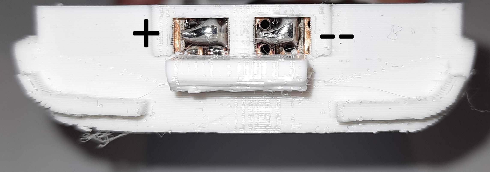

# Baofeng UV-5R Battery Case
A simple battery case for the Baofeng UV-5R (and maybe some other Baofeng models) radio.

It was inspired by commercial battery adapters, which can be bought online:

(Source: https://i.ebayimg.com/images/g/b9gAAOSwS9BdGHeZ/s-l1600.jpg

The 3D-model of the case can be downloaded from this Github repository. The original model was made by  jameslee522 (https://www.thingiverse.com/thing:4607617 / CC BY 4.0). I customized it using Tinkercad, where you can also find this model:  https://www.tinkercad.com/things/dRWLIG0PLxn

## Original Battery Pack
The nominal voltage is 7.4V (Li-ion cell)

pinout: 

## Electronics
I designed the case in a way, that it can be plugged into a USB-5V source like a powerbank. For this purpose it uses a step-up converter, which you can easily find online. There is also a capacitor to provide a stable voltage at current spikes (for example in the transmit mode).

The battery connection poles can be created using some strip grid circuit board with some drops of solder on it (see pictures).

You can also modify the design to work with a 12V power source (like a car socket) by using a step-down converter.

The output voltage must be set to 7.4V!!

## Final design

  

This work by Dustin Brunner is licensed under <a rel="license" href="https://creativecommons.org/licenses/by/4.0">CC BY 4.0</a>

 Dieses Werk von Dustin Brunner ist lizenziert unter einer <a rel="license" href="http://creativecommons.org/licenses/by/4.0/">Creative Commons Namensnennung 4.0 International Lizenz</a>.
